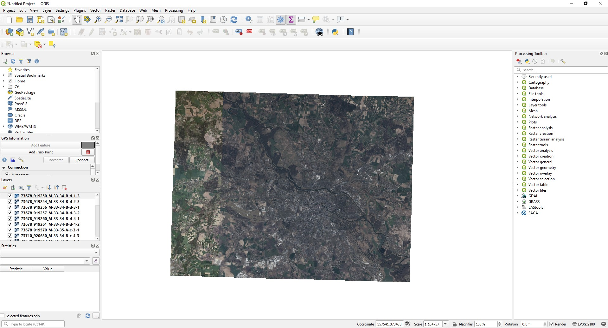
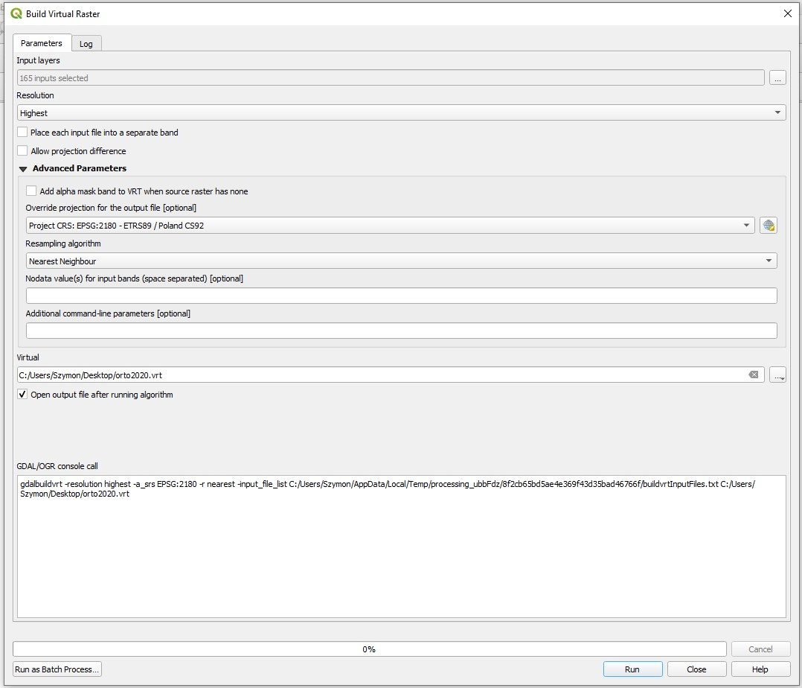
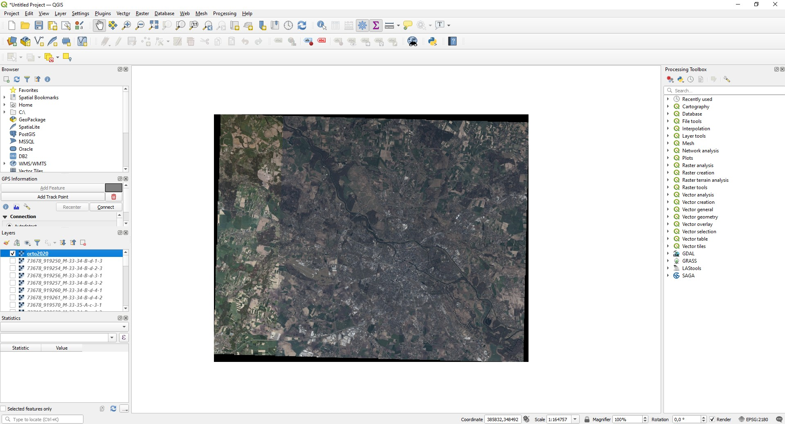
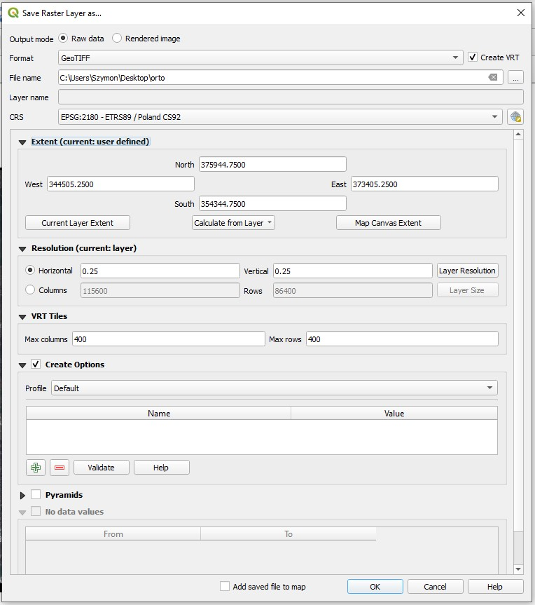

## Aby uruchomić eksperymenty należy:
1. Pobrać zbiór [UC Merced](http://weegee.vision.ucmerced.edu/datasets/UCMerced_LandUse.zip), wypakować go i skopiować foldery z UCMerced_LandUse/Images do folderu z danymi projektu: ./data/raw/uc_merced.
2. Pobrać zbiór [PatternNet](https://drive.google.com/u/0/uc?id=127lxXYqzO6Bd0yZhvEbgIfz95HaEnr9K&export=download), wypakować go i skopiować foldery z PatternNet/images do folderu z danymi projektu: ./data/raw/pattern_net.
3. W przypadku Windowsa uruchomić skrypt .\run-experiments.ps1. W przypadku Linuksa uruchomić skrypt ./run-experiments.sh.

## Zbiór z ortofotomapy
Ze względu na rozmiar uzyskanego zbioru (~400GB), oraz półautomatyczny proces jego konstruowania, nie jesteśmy go niestety w stanie udostępnić w całości. Poniżej został opisany proces generowania zbioru z plików dostępnych do pobrania z [rządowego geoportalu](https://mapy.geoportal.gov.pl/imap/Imgp_2.html).
Pobrane przez nas pliki potrzebne do wygenerowania zbioru zajmują około 7GB i zostały udostępnione [tutaj](https://drive.google.com/file/d/1YvwibxuxpdgG1VqF9RgTsavhUJF08M2g/view?usp=sharing).

### Generowanie
Proces generowania zbioru z ortofotomapy jest półautomatyczny i wymaga wykorzystania zewnętrznego narzędzia geoinformacyjnego (GIS). Tutaj zostało to opisane na przykładzie darmowego narzędzia QGIS.
1. Pobrać [pliki](https://drive.google.com/file/d/1YvwibxuxpdgG1VqF9RgTsavhUJF08M2g/view?usp=sharing) ze zdjęciami z ortofotomapy.
2. Wczytać pliki z rozpakowanego folderu do programu QGIS. W tym celu należy kliknąć "Layer -> Add Layer -> Add Raster Layer", a następnie wybrać wszystkie pliki .tif z rozpakowanego folderu.

3. Następnie należy utworzyć ze wszystkich wczytanych plików wirtualny raster. W tym celu należy wybrać opcję "Raster -> Miscellaneous -> Build Virtual Raster...". W otwartym oknie należy wybrać wszystkie pliki z projektu jako "Input layers". Resztę opcji należy ustawić tak jak na obrazku poniżej. Szczególnie ważne jest aby odznaczyć "Place each input file into a separate band". Na koniec należy wybrać "Run".

4. Po utworzeniu wirtualnego rastra powinien pojawić się w liście warstw po lewej stronie okna programu.

5. Ostatnim krokiem w programie QGIS jest wygenerowanie obrazów bazowych (*anchor*). W tym celu należy kliknąć prawym przyciskiem myszy na warstwę z wirtualnym rastrem i wybrać "Export -> Save As...". Następnie opcje ustawić tak jak na obrazku poniżej. Należy zaznaczyć "Create VRT", ustawić "zasięg warstwy brany pod uwagę zgodnie z wartościami w pliku *extent.txt*, oraz ustawić liczbę kolumn i wierszy w VRT Tiles na 400.

6. Następnie należy w folderze data/raw w projekcie utworzyć folder o nazwie "orto". Wewnątrz tego folderu utworzyć dwa foldery: "anchors" oraz "positive". Do folderu anchors skopiować wszystkie pliki .tif z folderu z kroku 5.
7. Następnie należy zainstalować bibliotekę rasterio oraz jej zależnośc - bibliotekę GDAL. Instrukcje są dostępne pod [tym](https://rasterio.readthedocs.io/en/latest/installation.html) linkiem. W przypadku Windowsa, należy pobrać pliki wheel [stąd](https://www.lfd.uci.edu/~gohlke/pythonlibs). Program był testowany z pythonem 3.8.6 oraz rasterio w wersji 1.1.8 i GDAL w wersji 3.1.4.
8. Następnie należy wygenerować zdjęcia pozytywne dla zdjęć bazowych. W tym celu należy uruchomić skrypt komendą 
* `python .\src\data\gdal_triplet_dataset_generator.py -s path\to\orto.vrt -a data\raw\orto\anchors -o data\raw\orto\positive` w przypadku Windowsa,
* `python ./src/data/gdal_triplet_dataset_generator.py -s path/to/orto.vrt -a data/raw/orto/anchors -o data/raw/orto/positive` w przypadku Linuksa.
W komendach należy zastąpić "path\to\orto.vrt" ścieżką do pliku wirtualnego rastra wygenerowanego w kroku 3. Do komendy można opcjonalnie dodać parametr "-n X" gdzie X oznacza liczbę wygenerowanych przykładów pozytywnych dla każdego obrazu bazowego. Domyślna liczba to 20. **UWAGA** Ten proces może zająć naprawdę dużo czasu, a wynikowy zbiór zajmuje > 400GB.
9.  Po wykonaniu tych kroków zbiór z ortofotomapy znajduje się w folderze data/raw/orto.